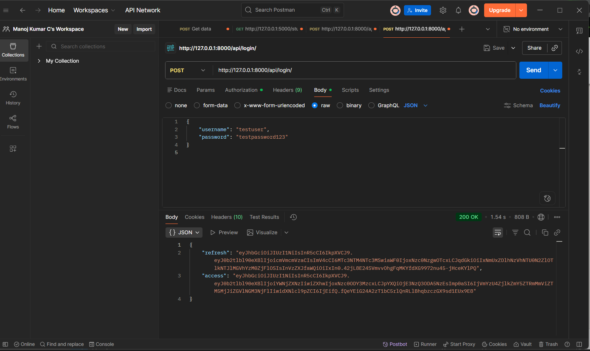
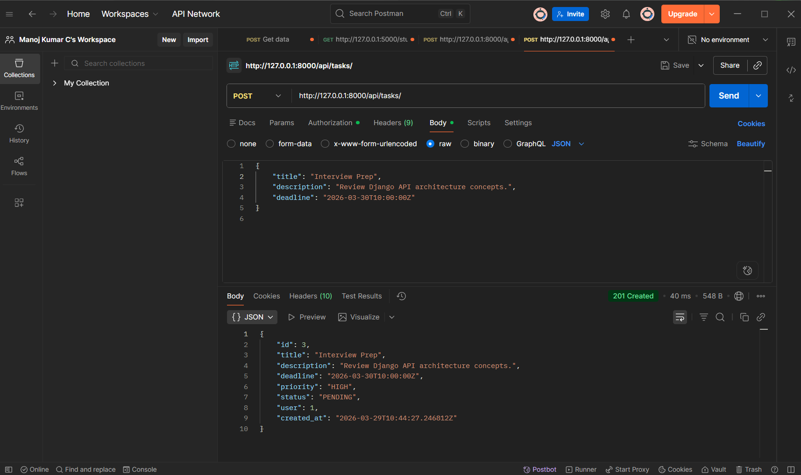
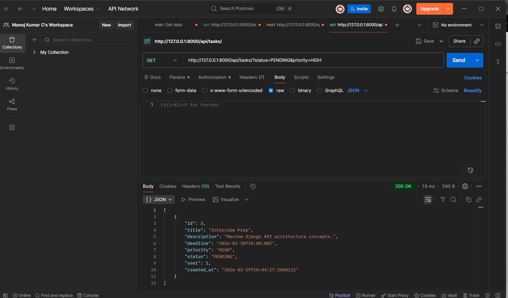

# Production-Ready Smart Task Management API with Django & JWT


> A robust, internship-level backend API built with Django and Django REST Framework, featuring **Smart Auto-Priority Logic** and secure **JWT Authentication**.

---

## 🌟 Why This Project Stands Out
Unlike standard CRUD applications, this API demonstrates real-world engineering decisions:
- **Separation of Concerns:** Business logic (priority calculation) is cleanly decoupled from Views into a dedicated `services/` layer.
- **Automated Smart Logic:** Tasks automatically assign themselves `HIGH`, `MEDIUM`, or `LOW` priority based on their `deadline` vs the server's current datetime.
- **Strict Data Isolation:** Endpoints strictly enforce that authenticated users can only access and modify their own tasks.

## Features
- **JWT Authentication**: Secure register and login flow.
- **Task Management**: Full CRUD operations for tasks, isolated per user.
- **Smart Priority Logic**: Tasks automatically get prioritized correctly:
  - `< 1 day` = **HIGH**
  - `< 3 days` = **MEDIUM**
  - Otherwise = **LOW**
- **Filtering**: Retrieve tasks correctly by `status` (`?status=completed`) or `priority` (`?priority=HIGH`).

## Architecture Breakdown
1. **Users App**: Handles `POST /api/register/` and `POST /api/login/`
2. **Tasks App**: Handles `GET/POST/PUT/DELETE /api/tasks/`
3. **Services Module**: The smart automation engine (`services/priority_calculator.py`) calculating priorities precisely.

## Deployment (100% Free on Render) 🚀
Since Render's Blueprint feature requires a paid plan, here is the manual step-by-step method to deploy this on the **Free Tier**:

1. **Create the Database:**
   - Go to [Render Dashboard](https://dashboard.render.com) > **New +** > **PostgreSQL**.
   - Name it `smart-task-db` and select the **Free** instance type.
   - Once created, copy the **Internal Database URL**.

2. **Create the Web Service:**
   - Click **New +** > **Web Service**.
   - Connect your GitHub repository.
   - Set **Build Command**: `./build.sh`
   - Set **Start Command**: `cd core && gunicorn core.wsgi:application`
   - Select the **Free** instance type.

3. **Set Environment Variables:**
   - Scroll down to Environment Variables and add:
     - `DATABASE_URL` = *(Paste the Internal Database URL from step 1)*
     - `SECRET_KEY` = *(Type any long random string)*
     - `PYTHON_VERSION` = `3.10.0`
   - Click **Create/Deploy Web Service**!

---

## Local Setup Steps

1. **Virtual Environment & Dependencies**
   ```bash
   python -m venv venv
   .\venv\Scripts\activate
   pip install -r requirements.txt
   ```

2. **Database Setup**
   Ensure you are in the `core` directory containing `manage.py`:
   ```bash
   cd core
   python manage.py makemigrations
   python manage.py migrate
   ```

3. **Run Server**
   ```bash
   python manage.py runserver
   ```

## API Endpoints

### Auth
- `POST /api/register/`
- `POST /api/login/`

### Tasks
- `GET /api/tasks/`
- `POST /api/tasks/`
- `PUT /api/tasks/{id}/`
- `DELETE /api/tasks/{id}/`

### Filters
- `/api/tasks/?status=completed`
- `/api/tasks/?priority=HIGH`

## Sample Request & Response

**`POST /api/tasks/`**

**Request:**
```json
{
  "title": "Finish project",
  "deadline": "2026-04-01T12:00:00Z"
}
```

**Response:**
```json
{
  "id": 1,
  "title": "Finish project",
  "description": "",
  "deadline": "2026-04-01T12:00:00Z",
  "priority": "HIGH",
  "status": "PENDING",
  "user": 1,
  "created_at": "2026-03-29T12:00:00Z"
}
```

## 📸 Proof of Work (Screenshots to Add)

*(Recruiters: These screenshots prove the JWT integration and Smart Logic work flawlessly in a real API client.)*

### 1. Secure JWT Login

> *Postman showing a successful `POST /api/login/` returning the `access` and `refresh` tokens*

### 2. Smart Priority Auto-Calculation

> *Postman showing a `POST /api/tasks/` request with NO priority sent, and the JSON response showing `"priority": "HIGH"` automatically assigned based on the deadline*

### 3. API Filtering in Action

> *Postman showing a `GET /api/tasks/?status=PENDING&priority=HIGH` request returning the correctly filtered list of tasks*
